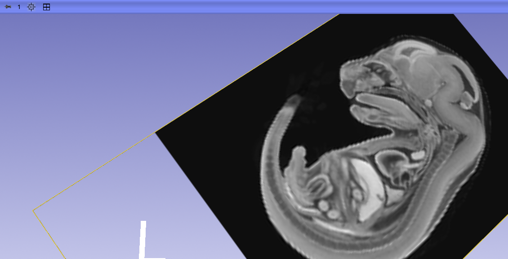
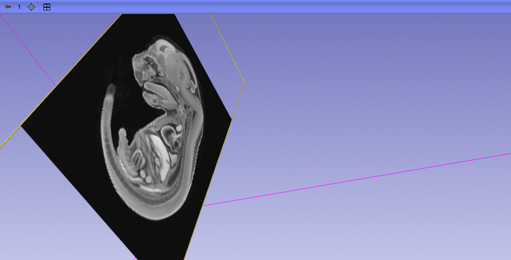

## MorphoDepot Repository
Repository for segmentation of a specimen scan.  See [this JSON file](MorphoDepotAccession.json) for specimen details.
* Species: 
* Modality: Micro CT (or synchrotron)
* Contrast: 
* Dimensions: (196, 256, 196)
* Spacing (mm): (0.05999999865889549, 0.05999999865889549, 0.05999999865889549)

## Screenshots

